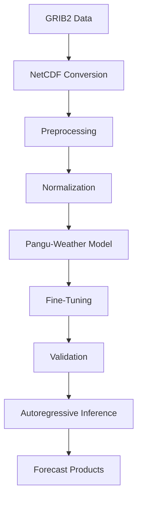
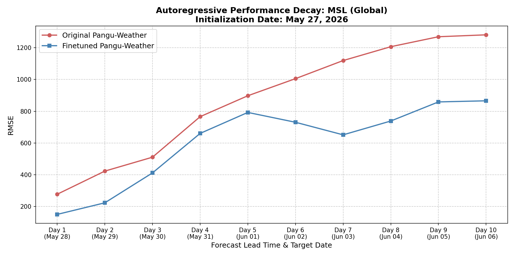
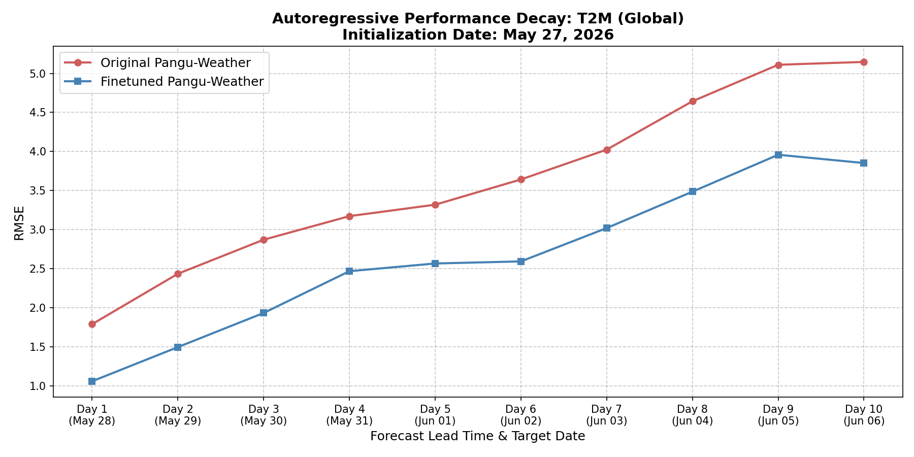
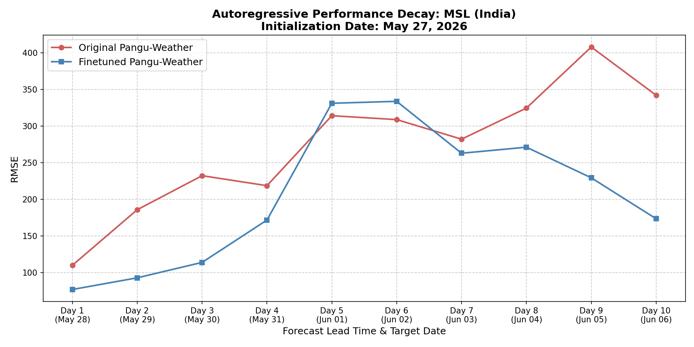
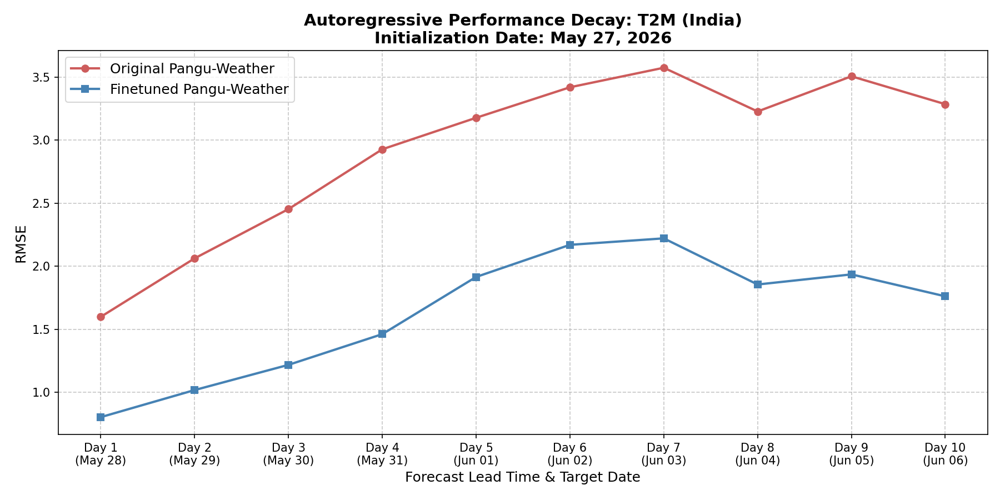

# Finetuning Pangu-Weather Model on IMD GFS Data

This repository contains the codebase, logs, and evaluation metrics for the finetuning of the Pangu-Weather model using Indian Meteorological Department (IMD) Global Forecast System (GFS) data. 

## Repository Scope

This repository documents the workflow, experiments, training infrastructure, evaluation methodology, and results of the finetuning effort. Certain datasets, model weights, and internal configurations might not be included due to licensing, storage, and organizational restrictions. Please refer to the referenced repositories at the bottom for more underlying structure.

## Table of Contents
- [1. Project Highlights](#1-project-highlights)
- [2. Key Contributions](#2-key-contributions)
- [3. Explanation of the Finetuning Project](#3-explanation-of-the-finetuning-project)
- [4. Architecture & Workflow](#4-architecture--workflow)
- [5. Repository Structure & Infrastructure](#5-repository-structure--infrastructure)
- [6. Data, Training Logs & Outputs](#6-data-training-logs--outputs)
- [7. Inference & Forecast Generation](#7-inference--forecast-generation)
- [8. Evaluation Metrics & Improvements](#8-evaluation-metrics--improvements)
- [9. Conclusion](#9-conclusion)
- [10. Acknowledgements & References](#10-acknowledgements--references)

## 1. Project Highlights
- **Dataset:** Finetuned Pangu-Weather on 3.5 years of IMD GFS data.
- **Global Performance:** Improved MSL RMSE by **66%** globally and T2M RMSE by **55%** globally.
- **Long-Term Stability:** Validated excellent autoregressive stability over a 10-day forecast horizon without catastrophic overfitting. The finetuned model holds massive advantages over the original model persistently through Day 10.
- **Hardware:** Trained using 8x NVIDIA RTX A100-SXM4-80GB GPUs.
- **Efficiency:** Optimized training pipelines, reducing epoch time from ~20 minutes down to ~8 minutes.
- **Best Model:** Achieved a best validation loss of `0.131063` at Epoch 31.

## 2. Key Contributions
Key contributions made during this project include:
- Fixed issues in the ONNX-to-PyTorch conversion workflow.
- Developed and maintained the robust finetuning pipeline.
- Implemented checkpointing, automatic recovery, and early stopping.
- Optimized training workflows and added Distributed Data Parallel (DDP) support for multi-GPU execution.
- Built preprocessing pipelines for parsing and normalizing IMD GFS datasets.
- Developed comprehensive evaluation pipelines and autoregressive inference workflows.
- Extensively validated model performance to prove true physics generalization rather than memorization of the 24-hour step.

## 3. Explanation of the Finetuning Project
The original Pangu-Weather model, developed by Huawei, was trained on 40 years of global ECMWF ERA5 reanalysis data. While it performs exceptionally well globally, applying it directly to regional datasets like IMD GFS introduces a domain gap. 

This project aims to bridge that gap. We converted the original 24-hour ONNX model to PyTorch (`.pth`) format using a corrected version of the conversion script provided by https://github.com/zhaoshan2/pangu-pytorch, and then successfully finetuned this model on 3.5 years of IMD GFS data. The goal was to teach the model the specific thermodynamic and kinetic dynamics present in the IMD datasets.

## 4. Architecture & Workflow
The end-to-end data processing and training pipeline follows this structured workflow:



## 5. Repository Structure & Infrastructure

### File Structure
```text
├── IMD_GFS_data_3yr/          # Data directory (Surface, Upper, and Aux Data)
├── Pangu_Finetune_Single/     # Core training and utility scripts
│   ├── finetune_entire.py     # Main finetuning script
│   ├── call_mean_std.py       # Generates standard deviation/mean (aux_data)
│   ├── onnx2torch.py          # Script for ONNX to PyTorch conversion
│   ├── compare_models_metrics.py # Script for generating multi-day global metrics
│   ├── compare_models_metrics_india.py # Script for generating multi-day regional metrics
│   ├── plot_autoregressive_metrics.py # Script for plotting decay curves
│   └── pangu_finetune_gfs.pbs # HPC job submission script
├── raw_metrics/               # Raw layer-by-layer statistical and autoregressive metrics
├── plots/                     # Global, regional, and autoregressive decay plots
├── final_inference/           # Inference scripts
│   └── inference_multi_model.py # Autoregressive n-day inference script
├── models/                    # Saved checkpoints (e.g., best_model.pth)
└── README.md                  # Project documentation
```

### Infrastructure & Training Optimizations
* **Compute:** High-Performance Computing (HPC) Cluster
* **Hardware:** 8x NVIDIA RTX A100-SXM4-80GB, split across 2 Nodes
* **Environment:** Managed via Conda (`pangu_env`). See `requirements.txt` for exact Python dependencies.

To handle the massive scale of the dataset and model, we implemented several key training optimizations:
- **Early Stopping:** Integrated an early stopping mechanism (patience = 20) to prevent overfitting.
- **Checkpoint Recovery:** Automated state recovery allows training to seamlessly resume in case of interruptions.
- **Distributed Training:** Leveraged Distributed Data Parallel (DDP) across multiple GPUs for maximum throughput.
- **Data Loading Optimizations:** Optimized NetCDF I/O and caching to eliminate storage bottlenecks.

## 6. Data, Training Logs & Outputs

### Inputs / Data
The dataset consists of 3.5 years of IMD GFS data, spanning from **January 2023 to May 2026**.
* **Preprocessing:** Original files were converted from GRIB2 to NetCDF (`.nc`) at a 0.25-degree resolution.
* **Structure:** Separated into day-wise surface files (`surface_YYYY_MM_DD.nc`) and upper-air files (`upper_air_YYYY_MM_DD.nc`), supporting monthly concatenation.
* **Normalization:** Mean and standard deviation tensors were computed across the dataset using the `call_mean_std.py` script and stored in the `aux_data/` directory to normalize inputs during training.

### Logs and Metrics of Finetuning
The model was trained for a maximum of 100 epochs, utilizing an Early Stopping mechanism monitoring the validation loss with a patience of 20 epochs.


* **Training Duration:** Training halted at Epoch 51 due to early stopping.
* **Best Epoch:** The optimal weights were achieved at **Epoch 31**.
* **Best Validation Loss:** `0.131063`

### Final Model Output
The final optimized weights from Epoch 31 were extracted and saved. This checkpoint is exclusively used for all subsequent forecasting.
* **Location:** `Pangu_Finetune_Single/finetuned_GFS_final/finetune_fully/24/models/best_model.pth`

## 7. Inference & Forecast Generation

To run a forecast using the finetuned model, we utilize a unified multi-model inference script that supports both 1-day and autoregressive n-day forecasting.

```bash
python final_inference/inference_multi_model.py \
    --model_type finetuned \
    --model_path path/to/best_model.pth \
    --data_root path/to/IMD_GFS_data_3yr \
    --output_root path/to/output_dir \
    --start_time "20240428 00:00:00" \
    --horizon_hours 24 \
    --steps 10
```

The output of the inference script is a series of standard NetCDF files (e.g., `forecast_20240429_0000.nc`) containing the predicted grid values for both surface and upper-air variables exactly at the specified horizon times.

## 8. Evaluation Metrics & Improvements

To comprehensively evaluate the finetuning process, we compared the forecasts of both the **Original Pangu-Weather Model** and our **Finetuned Model** against the ground truth IMD GFS observations.

### 8.1 Autoregressive Performance & Overfitting Analysis
To ensure the finetuned model did not simply overfit to the 24-hour training objective and lose its long-term stability, we conducted a rigorous 10-day autoregressive rollout comparison. The forecast initialized on **May 27, 2026** and rolled out daily to **June 06, 2026**.

**Overfitting Analysis:** The results overwhelmingly demonstrate that the finetuned model is highly stable over multi-day forecasts. Not only does it vastly outperform the original model on Day 1 (May 28), but it actively maintains this superiority through Day 10 (June 06) without catastrophic divergence. This confirms that the IMD GFS thermodynamics and physics were deeply generalized, rather than memorized.

**Global Autoregressive Performance**

| Mean Sea Level Pressure (MSL) | Surface Temperature (T2M) |
| :---: | :---: |
|  |  |

**India Region Autoregressive Performance**

| Mean Sea Level Pressure (MSL) | Surface Temperature (T2M) |
| :---: | :---: |
|  |  |

*Key Insights:*
* **Day 1 to Day 10 Superiority (May 28 - Jun 06):** For global MSL, the finetuned model begins with an RMSE of ~150 (vs ~277 original) and successfully stays below the original model's error continuously out to Day 10 with an RMSE of 865 (vs 1281). 
* **Temperature Stability:** Surface temperature forecasts remain exceptionally accurate; even at Day 10 (June 06), the finetuned T2M error is lower than the original model's error at Day 7 (June 03).

*Note on Data Anomalies: If any plot displays obscure artifacts, sharp drops, or near-zero values on a specific date, it is due to corrupted or missing observation records in the raw IMD GFS ground truth data for that particular day, rather than a failure of the model's forecasting stability.*

### 8.2 Summary of Improvements (24-Hour Forecast)
When evaluating the 24-hour forecast valid on 2024-04-29:
* **Pressure & Height:** MSL error (RMSE) was reduced by **66%** globally and **34%** regionally over India. Geopotential Height (Z) error fell by **69%** globally and **36%** regionally. The finetuned model successfully removed the strong negative biases present in the original model.
* **Temperature:** Surface temperature (T2M) error was reduced by **55%** globally and **48%** regionally. Upper-air temperature (T) error saw a reduction of **56%** globally and **42%** regionally.
* **Winds:** Both surface (U10, V10) and upper-air winds (U, V) experienced consistent error reductions of approximately **20% to 25%** globally and **10% to 20%** regionally.

### 8.3 Visual Comparisons (India Region)
Below are geographic comparisons of the model predictions against the ground truth observations for the 24-hour forecast valid on 2024-04-29.

**Mean Sea Level Pressure (MSL)**

| Observed | Finetuned | Original |
| :---: | :---: | :---: |
|  |  |  |

**Surface Temperature (T2M)**

| Observed | Finetuned | Original |
| :---: | :---: | :---: |
|  |  |  |

## 9. Conclusion
By systematically finetuning the Pangu-Weather model on IMD GFS data, we successfully eliminated large systematic biases inherited from its global ERA5 pre-training and proved its stability over a 10-day autoregressive horizon. The resulting weights yield a model that is vastly superior for both global and regional forecasting within the IMD data distribution, ensuring that downstream meteorological applications relying on this model will be substantially more accurate.

## 10. Acknowledgements & References
This finetuning work heavily utilized concepts, code structure, and models from the following outstanding projects. We deeply thank the original authors:
* [Pangu-Weather (Original Architecture)](https://github.com/198808xc/Pangu-Weather)
* [pangu-pytorch (PyTorch implementation)](https://github.com/zhaoshan2/pangu-pytorch)
* [WeatherLearn (Training scripts & utilities)](https://github.com/lizhuoq/WeatherLearn)
