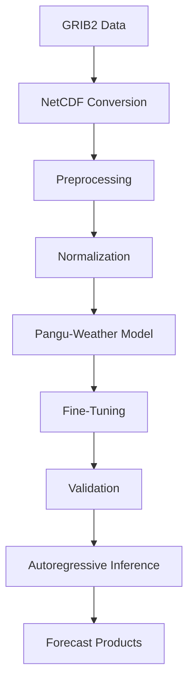
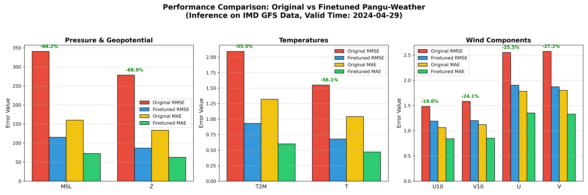
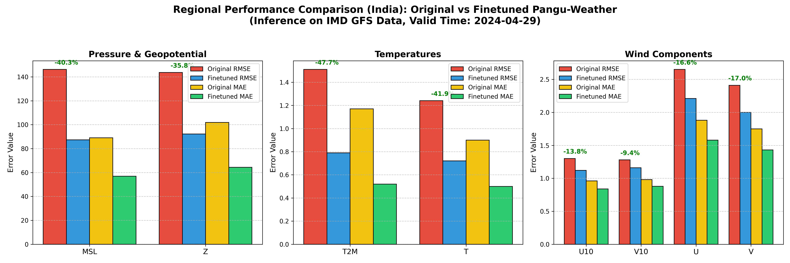
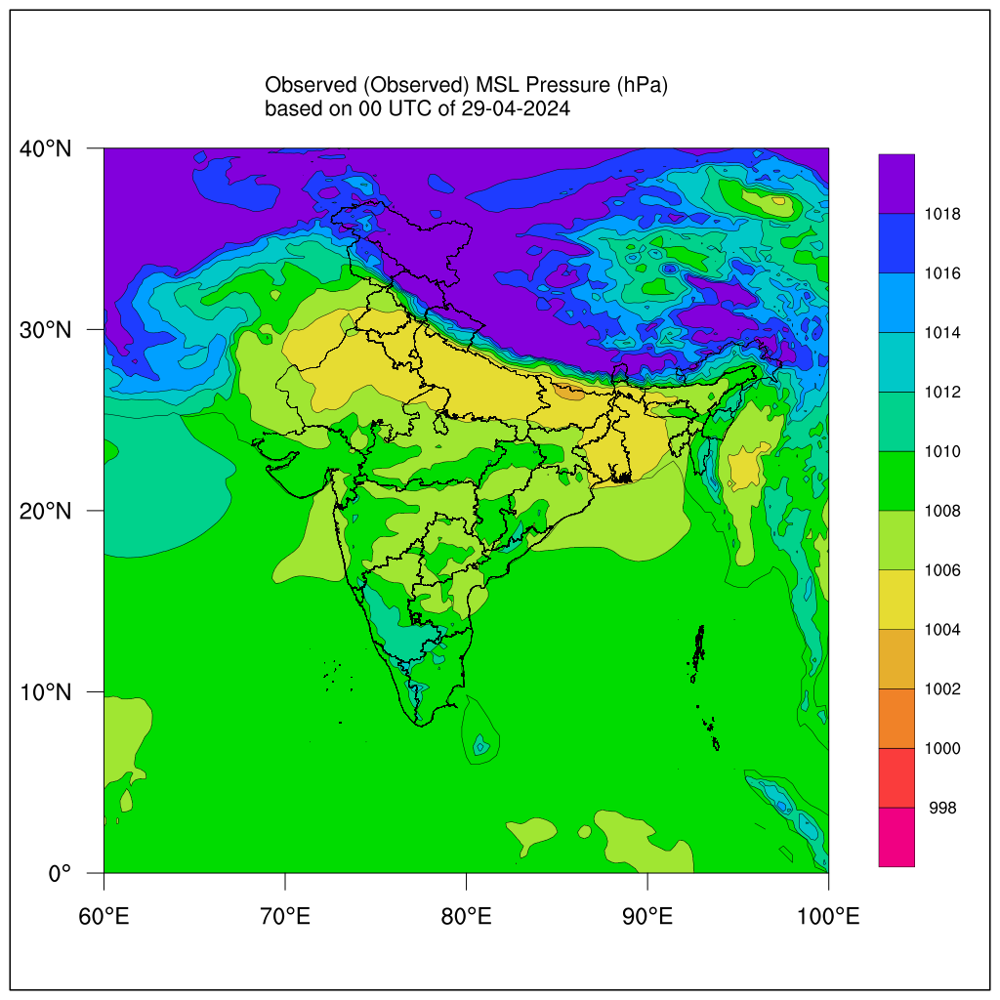
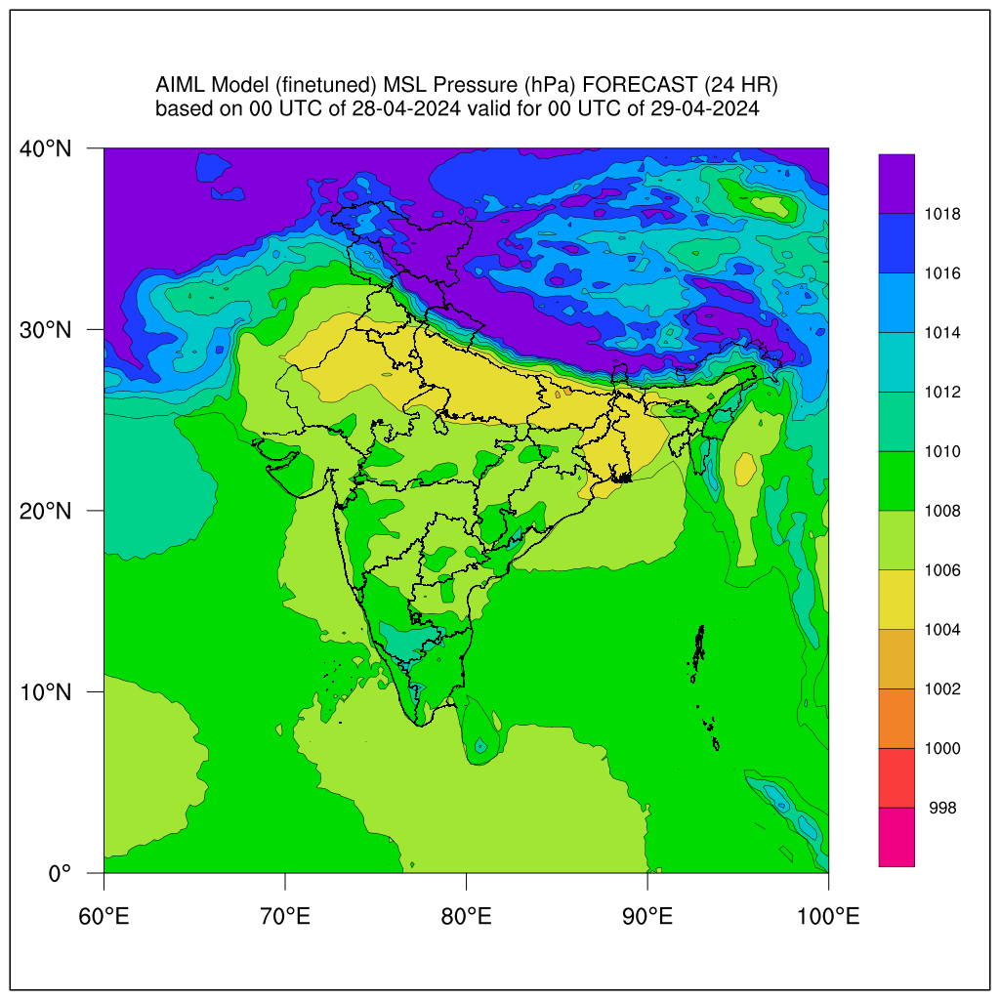
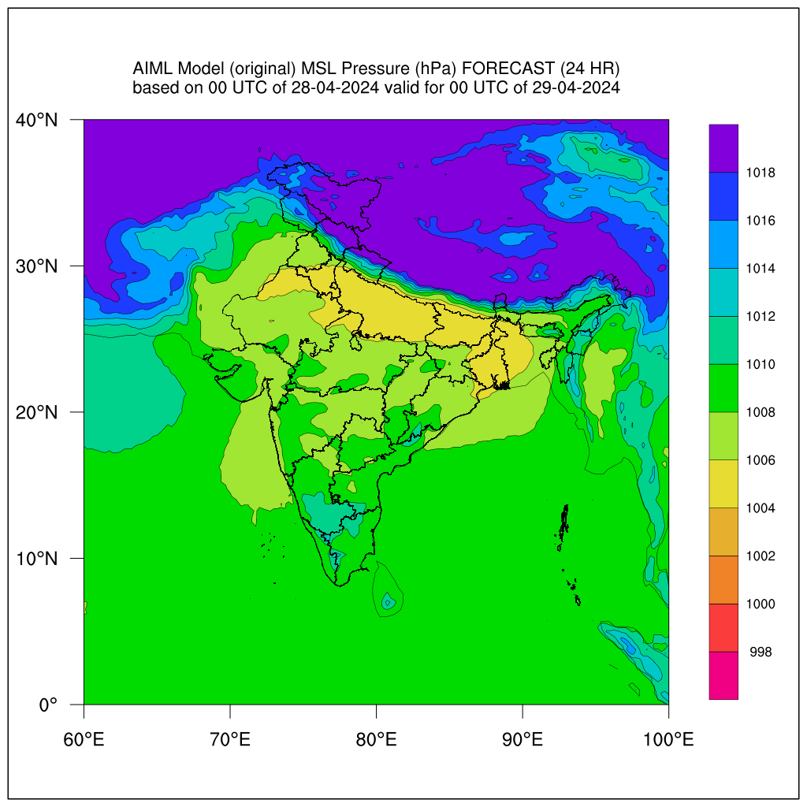
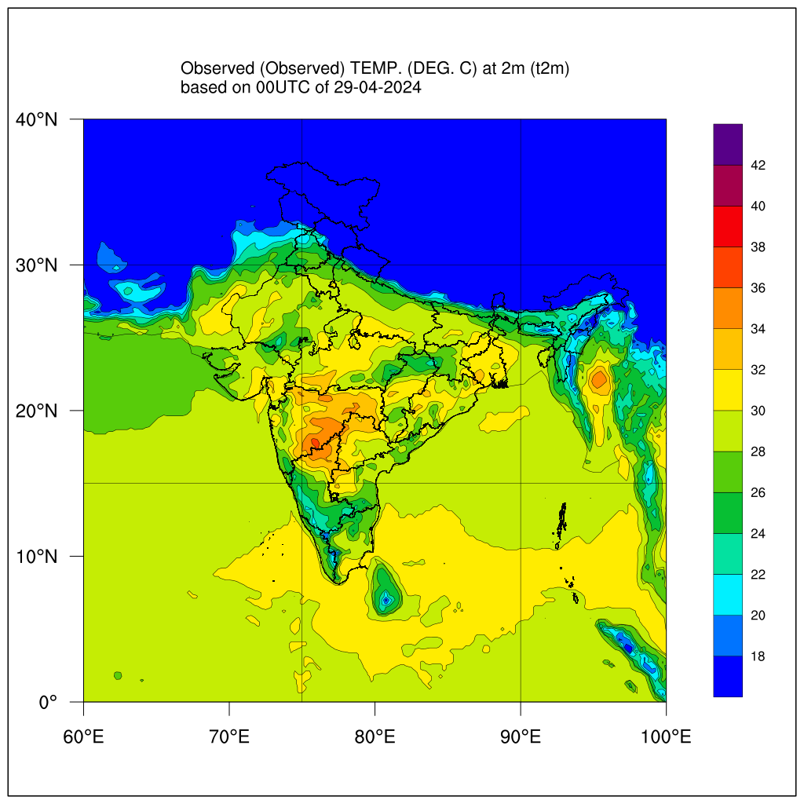
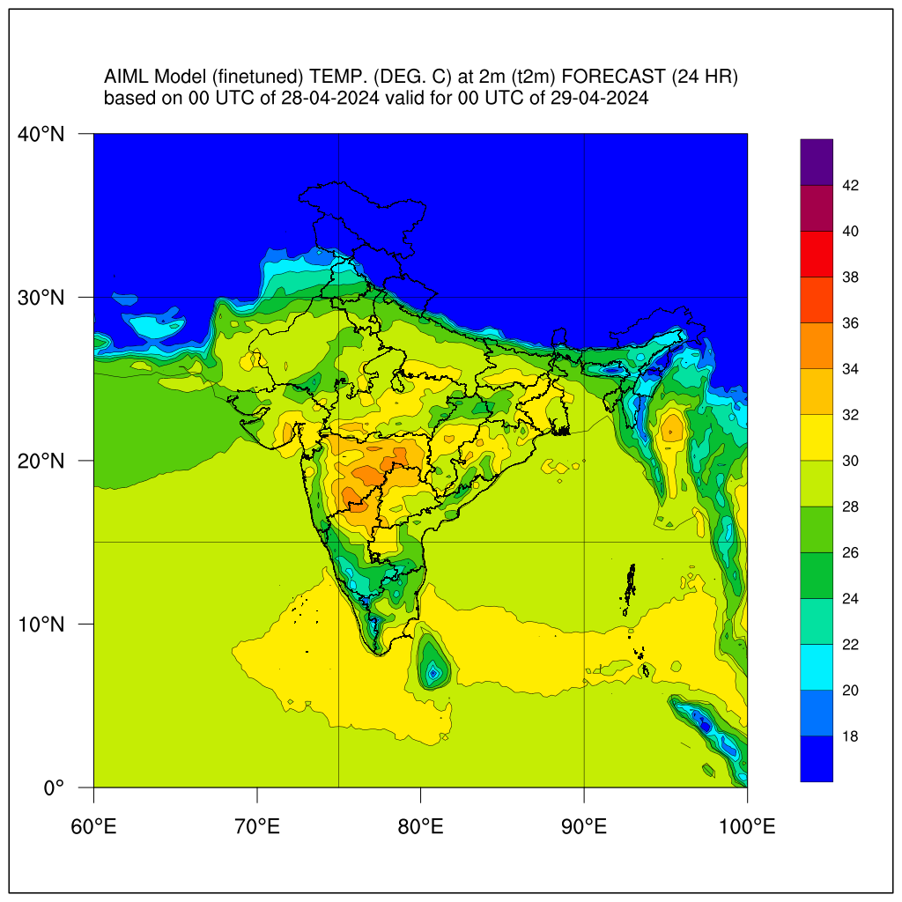
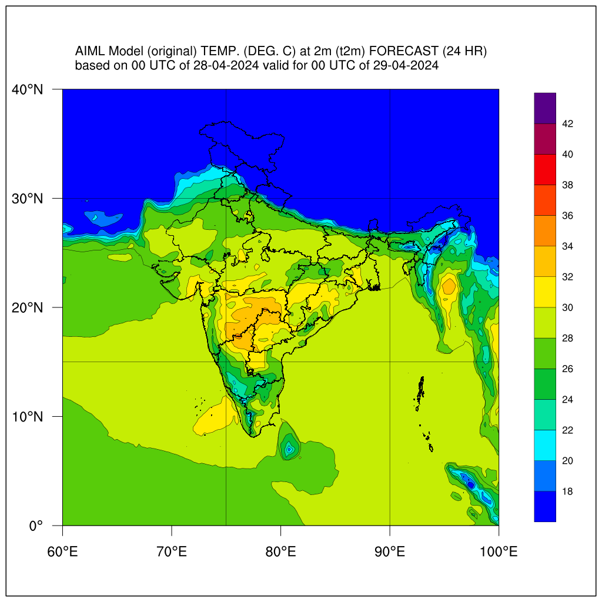

# Finetuning Pangu-Weather Model on IMD GFS Data

This repository contains the codebase, logs, and evaluation metrics for the finetuning of the Pangu-Weather model using Indian Meteorological Department (IMD) Global Forecast System (GFS) data. 

## 1. Project Highlights
- **Dataset:** Finetuned Pangu-Weather on 3.5 years of IMD GFS data.
- **Performance:** Improved MSL RMSE by **66%** globally and T2M RMSE by **55%** globally.
- **Hardware:** Trained using 8x NVIDIA RTX A100-SXM4-80GB GPUs.
- **Efficiency:** Optimized training pipelines, reducing epoch time from ~20 minutes down to ~8 minutes.
- **Best Model:** Achieved a best validation loss of `0.131063` at Epoch 31.

## 2. Explanation of the Finetuning Project
The original Pangu-Weather model, developed by Huawei, was trained on 40 years of global ECMWF ERA5 reanalysis data. While it performs exceptionally well globally, applying it directly to regional datasets like IMD GFS introduces a domain gap. 

This project aims to bridge that gap. We converted the original 24-hour ONNX model to PyTorch (`.pth`) format using a corrected version of the conversion script provided by https://github.com/zhaoshan2/pangu-pytorch, and then successfully finetuned this model on 3.5 years of IMD GFS data. The goal was to teach the model the specific thermodynamic and kinetic dynamics present in the IMD datasets.

## 3. Key Contributions
Key contributions made during this project include:
- Fixed issues in the ONNX-to-PyTorch conversion workflow.
- Developed and maintained the finetuning pipeline.
- Implemented checkpointing and automatic recovery.
- Added early stopping and experiment tracking.
- Optimized training workflows, reducing epoch time from ~20 minutes to ~8 minutes.
- Added Distributed Data Parallel (DDP) support for multi-GPU training.
- Developed autoregressive inference workflows for multi-day forecasting.
- Built preprocessing pipelines for IMD GFS datasets.
- Evaluated model performance against observations and operational forecasts.

## 4. Architecture & Workflow
The end-to-end data processing and training pipeline follows this structured workflow:



## 5. Files and File Structure

```text
├── IMD_GFS_data_3yr/          # Data directory (Surface, Upper, and Aux Data)
├── Pangu_Finetune_Single/     # Core training and utility scripts
│   ├── finetune_entire.py     # Main finetuning script
│   ├── compute_mean_std.py    # Generates standard deviation/mean (aux_data)
│   ├── compare_models_metrics.py # Script for generating evaluation metrics
│   └── pangu_finetune_gfs.pbs # HPC job submission script
├── final_inference/           # Inference scripts
│   └── inference_multi_model.py # Autoregressive n-day inference script
├── models/                    # Saved checkpoints (e.g., best_model.pth)
└── README.md                  # Project documentation
```

## 6. Infrastructure & Training Optimizations
* **Compute:** High-Performance Computing (HPC) Cluster
* **Hardware:** 8x NVIDIA RTX A100-SXM4-80GB, split across 2 Nodes
* **Environment:** Managed via Conda (`pangu_env`). See `requirements.txt` for exact Python dependencies.

**Training Optimizations:**
To handle the massive scale of the dataset and model, we implemented several key training optimizations:
- **Early Stopping:** Integrated an early stopping mechanism (patience = 20) to prevent overfitting.
- **Checkpoint Recovery:** Automated state recovery allows training to seamlessly resume in case of interruptions.
- **Distributed Training:** Leveraged Distributed Data Parallel (DDP) across multiple GPUs for maximum throughput.
- **Data Loading Optimizations:** Optimized NetCDF I/O and caching to eliminate storage bottlenecks.
- **Multi-Node HPC Execution:** Configured robust PBS submission scripts for seamless cluster deployment.

## 7. Inputs / Data
The dataset consists of 3.5 years of IMD GFS data, spanning from **January 2023 to May 2026**.
* **Preprocessing:** Original files were converted from GRIB2 to NetCDF (`.nc`) at a 0.25-degree resolution.
* **Structure:** Separated into day-wise surface files (`surface_YYYY_MM_DD.nc`) and upper-air files (`upper_air_YYYY_MM_DD.nc`) but it also supports monthly files (`surface_YYYY_MM.nc`) and (`upper_air_YYYY_MM.nc`) for surface and upper air files respectively.
* **Normalization:** Mean and standard deviation tensors were computed across the dataset using `compute_mean_std.py` script and stored in the `aux_data/` directory to normalize inputs during training.

## 8. Logs and Metrics of Finetuning
The model was trained for a maximum of 100 epochs, utilizing an Early Stopping mechanism monitoring the validation loss with a patience of 20 epochs.


* **Training Duration:** Training halted at Epoch 51 due to early stopping.
* **Best Epoch:** The optimal weights were achieved at **Epoch 31**.
* **Best Validation Loss:** `0.131063`

## 9. Output File
The final optimized weights from Epoch 31 were extracted and saved. This checkpoint is exclusively used for all subsequent forecasting.
* **Location:** `Pangu_Finetune_Single/finetuned_GFS_final/finetune_fully/24/models/best_model.pth`

## 10. Inference and Scripts
To run a forecast using the finetuned model, we utilize a unified multi-model inference script that supports both 1-day and autoregressive n-day forecasting.

```bash
python final_inference/inference_multi_model.py \
    --model_type finetuned \
    --model_path path/to/best_model.pth \
    --data_root path/to/IMD_GFS_data_3yr \
    --output_root path/to/output_dir \
    --start_time "20240428 00:00:00" \
    --horizon_hours 24 \
    --steps 1
```

## 11. Inference Output
The output of the inference script is a standard NetCDF file (e.g., `forecast_20240429_0000.nc`) containing the predicted grid values for both surface and upper-air variables exactly 24 hours from the initialization time.

## 12. Final Evaluation Metrics (Validation Set)
To comprehensively evaluate the finetuning process, we compared the 24-hour forecasts of both the **Original Pangu-Weather Model** and our **Finetuned Model** against the ground truth IMD GFS observations for the validation set (2024-04-29).

We evaluated the performance both **Globally** and specifically over the **India Region** (Lat: 0 to 40, Lon: 60 to 100). The full raw layer-by-layer statistical metrics are available in `raw_metrics/evaluation_metrics_raw.txt`.

### 12.1 Global Performance Comparison

The finetuned model significantly bridges the domain gap across the entire global grid, substantially reducing Root Mean Square Error (RMSE) and Mean Absolute Error (MAE) across all tested variables.



### 12.2 India Region Performance Comparison

When evaluating exclusively over the Indian geographic region, the finetuned model shows dramatic structural improvements. It almost entirely corrects the extreme negative biases seen in the original model for metrics like Mean Sea Level Pressure (MSL) and Geopotential Height (Z).



### 12.3 Visual Comparisons (India Region)

Below are geographic comparisons of the model predictions against the ground truth observations for the 24-hour forecast valid on 2024-04-29.

**Mean Sea Level Pressure (MSL)**

| Observed | Finetuned | Original |
| :---: | :---: | :---: |
|  |  |  |

**Surface Temperature (T2M)**

| Observed | Finetuned | Original |
| :---: | :---: | :---: |
|  |  |  |

## 13. Summary of Improvements
* **Pressure & Height:** MSL error (RMSE) was reduced by **66%** globally and **34%** regionally over India. Geopotential Height (Z) error fell by **69%** globally and **36%** regionally. The finetuned model successfully removed the strong negative biases present in the original model.
* **Temperature:** Surface temperature (T2M) error was reduced by **55%** globally and **48%** regionally. Upper-air temperature (T) error saw a reduction of **56%** globally and **42%** regionally.
* **Winds:** Both surface (U10, V10) and upper-air winds (U, V) experienced consistent error reductions of approximately **20% to 25%** globally and **10% to 20%** regionally.

## 14. Conclusion
By systematically finetuning the Pangu-Weather model on IMD GFS data, we successfully eliminated large systematic biases inherited from its global ERA5 pre-training. The resulting weights yield a model that is vastly superior for both global and regional forecasting within the IMD data distribution, ensuring that downstream meteorological applications relying on this model will be substantially more accurate.

## 15. Acknowledgements & References
This finetuning work heavily utilized concepts, code structure, and models from the following outstanding projects. We deeply thank the original authors:
* [Pangu-Weather (Original Architecture)](https://github.com/198808xc/Pangu-Weather)
* [pangu-pytorch (PyTorch implementation)](https://github.com/zhaoshan2/pangu-pytorch)
* [WeatherLearn (Training scripts & utilities)](https://github.com/lizhuoq/WeatherLearn)
